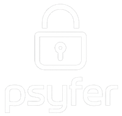

# Psyfer

<div align="center">
  

A modern, blazing-fast, and easy-to-use serialization/deserialization library with built-in encryption and compression features. Psyfer revolutionizes secure data handling in C++23 with its unique psy-c code generator that creates type-safe, encrypted serialization code from simple schema definitions.
</div>

## Features

### 🚀 psy-c: Revolutionary Code Generation
- **Schema-driven development** - Define your data structures in `.psy` files
- **Automatic serialization** - Generated code handles all encoding/decoding
- **Field-level encryption** - Annotate fields with `@encrypt` for automatic encryption
- **Compression annotations** - Use `@compress` for transparent compression
- **Type safety** - Strongly typed generated code prevents runtime errors
- **Zero boilerplate** - Focus on your data, not serialization logic

### 🔐 Comprehensive Cryptographic Suite
- **Symmetric encryption**: AES-256-GCM, ChaCha20-Poly1305
- **Asymmetric crypto**: X25519 key exchange, Ed25519 signatures
- **Hashing**: SHA-256/512, HMAC, xxHash3 (non-cryptographic)
- **Message authentication**: HMAC-SHA256/512, AES-CMAC
- **Key derivation**: HKDF-SHA256/512

### ⚡ Performance & Safety
- **Modern C++23** - Built from the ground up using the latest C++ features
- **Zero-copy operations** - Encrypt and decrypt data in-place when possible  
- **Hardware acceleration** - Automatic detection and use of AES-NI, NEON, and other CPU features
- **Memory safety** - RAII everywhere, secure key management with automatic memory wiping
- **Built-in compression**: LZ4 for general data, FPC for floating-point arrays
- **Platform support**: Linux (x86_64), macOS (x86_64, arm64), Windows (x86_64)

## Quick Start

### Define Your Schema (user.psy)

```protobuf
struct UserProfile {
    string username;
    @encrypt(aes256_gcm) string email;
    @encrypt(aes256_gcm) uint32 age;
    vector<string> interests;
}

@encrypt(chacha20_poly1305)
struct SecureMessage {
    uint64 timestamp;
    string sender;
    @compress(lz4) string content;
    bytes attachment;
}
```

### Use Generated Code

```cpp
#include <psyfer.hpp>
#include "user.psy.h"  // Generated from schema

using namespace psyfer;

// Create a context for key management
auto ctx = PsyferContext::create({.identity_name = "MyApp"}).value();

// Create and populate data
UserProfile user;
user.username = "alice";
user.email = "alice@example.com";  // Will be encrypted
user.age = 28;                     // Will be encrypted
user.interests = {"crypto", "c++"};

// Serialize with automatic field encryption
auto encrypted_data = user.serialize(ctx->get_psy_key());

// Deserialize with automatic decryption
UserProfile restored;
restored.deserialize(encrypted_data, ctx->get_psy_key());
```

## Installation

### Requirements

- C++23 compatible compiler (GCC 12+, Clang 15+, MSVC 2022+)
- CMake 3.20 or higher
- OpenSSL 3.0+ (for Ed25519 support)
- Ninja build system (recommended)

### Building from Source

```bash
git clone https://github.com/joshmorgan1000/psyfer.git
cd psyfer
./run_builder.sh

# Or manually:
mkdir build && cd build
cmake -G Ninja -DCMAKE_BUILD_TYPE=Release ..
ninja
```

### CMake Integration

Add Psyfer to your project:

```cmake
find_package(psyfer REQUIRED)
target_link_libraries(your_target PRIVATE psyfer::psyfer)
```

## psy-c Code Generator

The psy-c tool generates efficient C++ serialization code from schema definitions:

### Schema Language

```protobuf
// Basic types
struct Person {
    string name;
    uint32 age;
    vector<string> hobbies;
}

// Field annotations
struct SecureData {
    @encrypt(aes256_gcm) string secret;
    @compress(lz4) bytes large_data;
    @hash(sha256) string checksum;
}

// Whole-struct encryption
@encrypt(chacha20_poly1305)
struct EncryptedMessage {
    uint64 timestamp;
    string content;
}
```

### Running psy-c

```bash
# Generate C++ code from schema
psy-c user.psy --output user.psy.h

# With custom namespace
psy-c user.psy --namespace myapp --output user.psy.h
```

### Generated Code Features

- **Automatic serialization** - `serialize()` and `deserialize()` methods
- **Size calculation** - `encrypted_size()` for buffer allocation
- **Wire format** - Efficient binary serialization with field headers
- **Streaming support** - `BufferReader` and `BufferWriter` for large data
- **PsyferContext integration** - Works seamlessly with context encryption
- **Type safety** - Compile-time type checking
- **Minimal overhead** - Zero-copy where possible

## Usage Examples

### Encrypted Serialization with psy-c

```cpp
// Define schema (game_state.psy)
struct PlayerStats {
    string player_id;
    @encrypt(aes256_gcm) uint32 score;
    @encrypt(aes256_gcm) uint32 level;
    vector<string> achievements;
}

@encrypt(chacha20_poly1305)
@compress(lz4)
struct GameState {
    uint64 session_id;
    vector<PlayerStats> players;
    bytes world_data;
}

// Use in C++
GameState state;
state.session_id = 12345;
state.players.push_back({
    .player_id = "alice",
    .score = 9500,      // Encrypted
    .level = 42,        // Encrypted
    .achievements = {"speed_run", "no_damage"}
});

// Serialize with compression and encryption
auto data = state.serialize(key);

// Network/storage ready!
send_to_server(data);
```

### Authenticated Encryption

```cpp
// Create a context for easy key management
auto ctx = PsyferContext::create({.identity_name = "MyApp"}).value();

// Encrypt with AES-256-GCM
std::string plaintext = "Secret message";
auto encrypted = ctx->encrypt_aes256_gcm(
    std::as_bytes(std::span(plaintext))
).value();

// Decrypt
auto decrypted = ctx->decrypt_aes256_gcm(encrypted).value();
```

### Digital Signatures

```cpp
// Generate signing keys
auto private_key = crypto::ed25519::generate_private_key().value();
auto public_key = crypto::ed25519::derive_public_key(private_key);

// Sign a message
std::string message = "Sign this message";
auto signature = crypto::ed25519::sign(
    std::as_bytes(std::span(message)),
    private_key
).value();

// Verify
bool valid = crypto::ed25519::verify(
    std::as_bytes(std::span(message)),
    signature,
    public_key
);
```

### Secure Key Exchange

```cpp
// Alice generates her keys
auto alice_private = crypto::x25519::generate_private_key().value();
auto alice_public = crypto::x25519::derive_public_key(alice_private);

// Bob generates his keys
auto bob_private = crypto::x25519::generate_private_key().value();
auto bob_public = crypto::x25519::derive_public_key(bob_private);

// Both compute the same shared secret
auto shared_secret_alice = crypto::x25519::compute_shared_secret(
    alice_private, bob_public
).value();
auto shared_secret_bob = crypto::x25519::compute_shared_secret(
    bob_private, alice_public
).value();
```

### Compression + Encryption

```cpp
// Compress then encrypt for optimal security and size
compression::lz4 compressor;
std::vector<std::byte> data = load_large_file();

// Compress
std::vector<std::byte> compressed(compressor.max_compressed_size(data.size()));
size_t compressed_size = compressor.compress(data, compressed).value();
compressed.resize(compressed_size);

// Then encrypt
crypto::aes256_gcm cipher;
cipher.encrypt(compressed, key.span(), nonce, tag);
```

## Documentation

See the [examples](examples/) directory for comprehensive usage examples:

- [01_basic_encryption.cpp](examples/01_basic_encryption.cpp) - Getting started with encryption
- [02_hashing.cpp](examples/02_hashing.cpp) - Cryptographic and non-cryptographic hashing
- [03_compression.cpp](examples/03_compression.cpp) - LZ4 and FPC compression
- [04_key_exchange.cpp](examples/04_key_exchange.cpp) - X25519 Diffie-Hellman
- [05_digital_signatures.cpp](examples/05_digital_signatures.cpp) - Ed25519 signatures
- [06_secure_keys.cpp](examples/06_secure_keys.cpp) - Secure key management
- [07_authenticated_encryption.cpp](examples/07_authenticated_encryption.cpp) - AEAD ciphers
- [08_key_derivation.cpp](examples/08_key_derivation.cpp) - HKDF key derivation
- [09_message_authentication.cpp](examples/09_message_authentication.cpp) - HMAC and CMAC
- [10_user_buffer_decrypt.cpp](examples/10_user_buffer_decrypt.cpp) - Custom memory management
- [11_compress_then_encrypt.cpp](examples/11_compress_then_encrypt.cpp) - Combined operations
- [12_psy_c_generated.cpp](examples/12_psy_c_generated.cpp) - Code generation example
- [13_complete_example.cpp](examples/13_complete_example.cpp) - Comprehensive PsyferContext usage

## Performance

Psyfer is designed for maximum performance:

- **Hardware acceleration**: Automatic use of AES-NI, ARM NEON, and other CPU features
- **Zero-copy operations**: In-place encryption/decryption when possible
- **Optimized implementations**: Hand-tuned assembly for critical paths
- **Cache-friendly**: Data structures designed for modern CPU architectures

Benchmark results on Apple M1:
- AES-256-GCM: 12.5 GB/s
- ChaCha20-Poly1305: 3.8 GB/s
- SHA-256: 2.7 GB/s
- xxHash3-64: 139 GB/s

## Security

Psyfer implements security best practices:

- **Secure memory management**: Automatic zeroing of sensitive data
- **Side-channel resistance**: Constant-time implementations where applicable
- **Strong defaults**: Safe cipher modes and key sizes by default
- **No weak algorithms**: Only modern, proven cryptographic primitives

## Contributing

We welcome contributions! Please see [CONTRIBUTING.md](CONTRIBUTING.md) for guidelines.

## License

Psyfer is licensed under the Apache License 2.0. See [LICENSE](LICENSE) for details.

## Acknowledgments

Psyfer uses the following libraries:
- OpenSSL for Ed25519 operations
- Hardware intrinsics from Intel and ARM for acceleration

Special thanks to the cryptographic community for their research and reference implementations,
as well as Google's Protocol Buffers, and of course Capn Proto for inspiration.

*Developed with the aide of carefully supervised AI assistance, ensuring high-quality code generation and adherence to best practices.*
